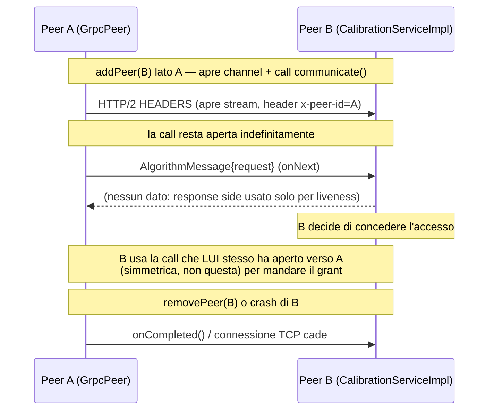
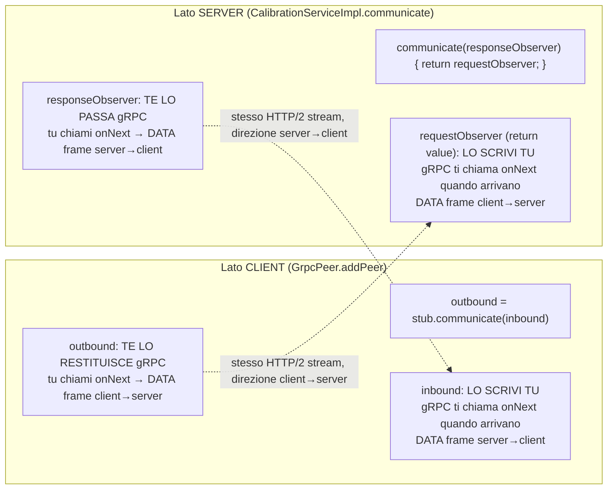

# Migrazione a gRPC streaming — design e funzionamento a basso livello

> **Stato**: proposta di design, non ancora implementata. Il codice attuale
> (`GrpcPeer`, `CalibrationServiceImpl`, `smartfab.proto`) usa 4 RPC unarie
> (`requestCalibration`, `grantCalibrationAccess`, `joinP2P`, `exitP2P`) con
> risposta `Empty` sistematicamente ignorata (vedi `ObserverFactory.emptyStreamObserver()`).
> Questo documento descrive perché e come sostituirle con un unico canale
> gRPC bidirezionale persistente per coppia di peer, e spiega il funzionamento
> a basso livello (HTTP/2, socket, syscall) necessario per capire *perché*
> la soluzione funziona.

## Indice

1. [Perché migrare](#1-perché-migrare)
2. [Il nuovo proto](#2-il-nuovo-proto)
3. [Topologia e ciclo di vita del canale](#3-topologia-e-ciclo-di-vita-del-canale)
4. [Binding peer → lineId: header vs. campo nel messaggio](#4-binding-peer--lineid-header-vs-campo-nel-messaggio)
5. [Wiring lato client e lato server](#5-wiring-lato-client-e-lato-server)
6. [Perché due `StreamObserver`](#6-perché-due-streamobserver)
7. [Flusso a basso livello: socket → HTTP/2 → gRPC](#7-flusso-a-basso-livello-socket--http2--grpc)
8. [Crash detection: FIN/RST vs. rete silenziosa](#8-crash-detection-finrst-vs-rete-silenziosa)
9. [Configurazione keepalive](#9-configurazione-keepalive)
10. [Checklist di migrazione](#10-checklist-di-migrazione)

---

## 1. Perché migrare

Oggi la "risposta" al grant non passa mai per la RPC che l'ha richiesta:
`requestCalibration` ritorna subito un `Empty` (ignorato), e il vero grant
arriva più tardi come **una RPC separata, in direzione opposta**
(`grantCalibrationAccess`), sullo stub che il destinatario tiene verso il
richiedente. Il commento in `ObserverFactory` lo dice esplicitamente:

> *"we assume that gRPC communications in the context of mutual exclusion
> algorithm are ONE-DIRECTIONAL. A Response is not handled through
> StreamObserver, but with another incoming gRPC Request."*

Due conseguenze dirette di questo schema:

- **Nessun crash detection**: se un peer muore mentre non hai nessuna
  RPC in corso verso di lui, non te ne accorgi finché non provi a
  parlargli di nuovo — il quorum resta sbagliato, `WaitingState` può
  restare bloccato indefinitamente aspettando un grant che non arriverà mai.
- **4 RPC per modellare quello che concettualmente è un solo bus di
  messaggi asincroni** tra due peer (request / grant / join / exit).

La soluzione: **un solo canale bidirezionale persistente per peer**,
aperto quando il peer entra nella rete e chiuso solo quando ne esce
(volontariamente o per crash), su cui transitano tutti e 4 i tipi di
messaggio.

## 2. Il nuovo proto

```proto
syntax = "proto3";
package smartfab;

message CalibrationRequest {
  int32 lineId    = 1;
  double priority = 2;
  int64  round    = 3;   // era "timestamp" ma nel codice era già castato a int
}

message CalibrationReply {
  int32 grantingLineId = 1;
  int64 round           = 2;
}

message P2PJoinRequest {
  int32 lineId         = 1;
  string senderAddress = 2;
  int32 senderPort     = 3;
}

message AlgorithmMessage {
  oneof payload {
    CalibrationRequest request = 1;
    CalibrationReply   grant   = 2;
    P2PJoinRequest      join   = 3;
    P2PJoinRequest      leave  = 4;
  }
}

service CalibrationService {
  rpc communicate(stream AlgorithmMessage) returns (stream AlgorithmMessage);
}
```

`grantCalibrationAccess` sparisce come RPC a sé: il granter non apre più
una chiamata verso il richiedente, scrive semplicemente sul canale già
aperto. Il campo `round` resta **obbligatorio e controllato esplicitamente**
(come già fa `onGrantReceived` oggi) perché un solo canale copre più round
nel tempo — non c'è più una call dedicata per round che lo disambigui da sola.

## 3. Topologia e ciclo di vita del canale

Si mantiene la topologia **simmetrica** già presente oggi in `addPeer`:
ciascun peer apre una propria `communicate()` verso ogni altro peer che
conosce (due connessioni indipendenti per coppia, una per direzione),
invece di provare a condividerne una sola tra i due lati — quest'ultima
sarebbe più elegante ma introduce un problema di coordinamento (chi apre
la call, race condition sul join) che non vale la complessità aggiuntiva
per questo progetto.



| Evento | Cosa succede al canale |
|---|---|
| `addPeer(peer)` | Si apre il `ManagedChannel` + si invoca **una sola volta** `asyncStub.communicate(inbound)`, salvando l'observer di invio in `PeerStub`. |
| Invio di un messaggio | `outbound.onNext(AlgorithmMessage...)` — nessuna nuova call, si scrive sul canale già aperto. |
| `removePeer(peerId)` / `shutdown()` | `outbound.onCompleted()` (half-close pulito) poi `channel.shutdown()`. |
| Il peer remoto esce volontariamente | Arriva un `AlgorithmMessage{leave}` sul canale — nessuna chiusura di connessione, è un messaggio applicativo come gli altri. |
| Il peer remoto crasha | La connessione TCP cade, il canale genera `onError` (vedi §7-8). |

## 4. Binding peer → lineId: header vs. campo nel messaggio

Ogni variante del `oneof AlgorithmMessage` porta **già** l'id del mittente
come campo (`CalibrationRequest.lineId`, `CalibrationReply.grantingLineId`,
`P2PJoinRequest.lineId`). Quindi per il dispatch normale di `onNext` **non
serve nessun header**: si legge direttamente dal payload —

```java
case REQUEST -> peer.onRequestReceived(msg.getRequest().getLineId(), ...);
```

— più semplice e senza rischio che header e payload raccontino id diversi.

C'è però un caso che il payload non può coprire: **`onError(Throwable t)`**.
Quando la connessione si rompe non è arrivato nessun `AlgorithmMessage` da
leggere — il transport ti sta solo dicendo "si è rotto qualcosa". Se l'unica
fonte dell'id fosse dentro i messaggi, e il peer remoto fosse morto *prima*
di mandarne mai uno, non ci sarebbe modo di sapere chi è appena morto su
quella specifica call.

Per questo la soluzione è **ibrida, e asimmetrica tra client e server**:

- **Lato client** (`addPeer`): non serve nessun header/interceptor — sei tu
  a scegliere di chiamare quel peer specifico, quindi conosci già
  `peer.getID()` e lo catturi per closure nella lambda. Punto.
- **Lato server** (`communicate()` in arrivo): qui serve sapere l'id *prima*
  che arrivi un messaggio, per l'eventuale `onError` senza payload. Un header
  HTTP/2 custom (`x-peer-id`), attaccato **una volta sola all'apertura della
  call** da un `ClientInterceptor` e letto lato server da un
  `ServerInterceptor`, copre anche il caso limite "il peer crasha prima di
  mandare il primo messaggio" — un'alternativa più leggera (leggere l'id dal
  *primo* `onNext` e salvarlo in una variabile locale) funzionerebbe per il
  caso comune ma lascerebbe scoperta esattamente quella finestra, che è
  proprio il tipo di race condition fastidiosa da spiegare in una discussione
  di un progetto distribuito.

Riassumendo: **il campo nel messaggio guida `onNext`, l'header serve solo
da paracadute per `onError`.**

```java
public final class PeerIdHeader {
    public static final Metadata.Key<String> KEY =
        Metadata.Key.of("x-peer-id", Metadata.ASCII_STRING_MARSHALLER);
    public static final Context.Key<Integer> CTX_KEY = Context.key("peerId");
}

```java
public final class PeerIdHeader {
    public static final Metadata.Key<String> KEY =
        Metadata.Key.of("x-peer-id", Metadata.ASCII_STRING_MARSHALLER);
    public static final Context.Key<Integer> CTX_KEY = Context.key("peerId");
}

final class PeerIdClientInterceptor implements ClientInterceptor {
    private final int selfId;
    PeerIdClientInterceptor(int selfId) { this.selfId = selfId; }

    @Override
    public <ReqT, RespT> ClientCall<ReqT, RespT> interceptCall(
            MethodDescriptor<ReqT, RespT> method, CallOptions opts, Channel next) {
        return new ForwardingClientCall.SimpleForwardingClientCall<>(next.newCall(method, opts)) {
            @Override
            public void start(Listener<RespT> responseListener, Metadata headers) {
                headers.put(PeerIdHeader.KEY, String.valueOf(selfId));
                super.start(responseListener, headers);
            }
        };
    }
}

final class PeerIdServerInterceptor implements ServerInterceptor {
    @Override
    public <ReqT, RespT> ServerCall.Listener<ReqT> interceptCall(
            ServerCall<ReqT, RespT> call, Metadata headers, ServerCallHandler<ReqT, RespT> next) {
        int peerId = Integer.parseInt(headers.get(PeerIdHeader.KEY));
        Context ctx = Context.current().withValue(PeerIdHeader.CTX_KEY, peerId);
        return Contexts.interceptCall(ctx, call, headers, next);
    }
}
```

`GrpcPeer` deve quindi conoscere il **proprio** `lineId` (oggi `new GrpcPeer()`
non lo prende — va aggiunto al costruttore).

## 5. Wiring lato client e lato server

**Client (`GrpcPeer.addPeer`)** — apre channel + call, salva l'handle di invio:

```java
public void addPeer(PeerInfo peer) {
    ManagedChannel channel = ManagedChannelBuilder.forAddress(peer.getAddress(), peer.getPort())
            .usePlaintext()
            .intercept(new PeerIdClientInterceptor(this.selfId))
            .keepAliveTime(10, TimeUnit.SECONDS)
            .keepAliveTimeout(5, TimeUnit.SECONDS)
            .build();

    var asyncStub = CalibrationServiceGrpc.newStub(channel);

    StreamObserver<AlgorithmMessage> inbound = new StreamObserver<>() {
        @Override public void onNext(AlgorithmMessage msg) {
            System.out.println("Unexpected reply payload from peer " + peer.getID());
        }
        @Override public void onError(Throwable t) {
            // solo log difensivo: NON chiamare qui onExitPeerReceived,
            // vedi nota sotto sulla dipendenza circolare
            System.out.println("Connection to peer " + peer.getID() + " lost: " + t.getMessage());
        }
        @Override public void onCompleted() {}
    };

    StreamObserver<AlgorithmMessage> outbound = asyncStub.communicate(inbound);

    synchronized (peersLock) {
        peers.put(peer, new PeerStub(channel, outbound));
    }
}
```

**Server (`CalibrationServiceImpl.communicate`)** — nessuna mappa da mantenere.
Il dispatch di `onNext` legge l'id **dal messaggio**; l'id ricavato
dall'header (`Context`) si usa **solo** nell'`onError`, dove non c'è
payload da leggere:

```java
@Override
public StreamObserver<AlgorithmMessage> communicate(StreamObserver<AlgorithmMessage> responseObserver) {
    int headerPeerId = PeerIdHeader.CTX_KEY.get(); // usato SOLO come fallback per onError

    return new StreamObserver<AlgorithmMessage>() {
        @Override
        public void onNext(AlgorithmMessage msg) {
            switch (msg.getPayloadCase()) {
                case REQUEST -> peer.onRequestReceived(msg.getRequest().getLineId(), msg.getRequest().getPriority(), (int) msg.getRequest().getRound());
                case GRANT   -> peer.onGrantReceived(msg.getGrant().getGrantingLineId(), (int) msg.getGrant().getRound());
                case JOIN    -> peer.onJoinPeerReceived(msg.getJoin().getLineId(), msg.getJoin().getSenderAddress(), msg.getJoin().getSenderPort());
                case LEAVE   -> peer.onExitPeerReceived(msg.getLeave().getLineId());
                default -> {}
            }
        }
        @Override
        public void onError(Throwable t) {
            // qui NON c'è nessun AlgorithmMessage da leggere: l'unica fonte
            // dell'id è l'header letto all'apertura della call
            System.out.println("Peer " + headerPeerId + " connection dropped: " + t.getMessage());
            peer.onExitPeerReceived(headerPeerId);   // qui, non lato client
        }
        @Override
        public void onCompleted() { responseObserver.onCompleted(); }
    };
}
```

> **Perché il crash si gestisce solo lato server**: `GrpcPeer` (il transport)
> non ha oggi nessun riferimento all'algoritmo — è l'algoritmo che dipende dal
> transport, mai il contrario (`ProductionLine.java`: `new RicartMutualExclusionPeer(peer, lineId)`).
> Far scattare `onExitPeerReceived` dall'`onError` lato client introdurrebbe una
> dipendenza circolare nuova solo per questo. Non serve: la topologia è
> simmetrica, quindi se B crasha, anche la call che **B** aveva aperto verso
> **A** si rompe, e lì l'`onError` scatta dentro `CalibrationServiceImpl`, che
> il riferimento all'algoritmo (`MutualExclusionAlgorithm peer`) ce l'ha già.

## 6. Perché due `StreamObserver`

Non è "uno per inviare e uno per ricevere" in senso simmetrico: uno lo
**implementi tu** (è un callback — gRPC lo invoca quando arrivano dati
dall'altro lato), l'altro te lo **restituisce/passa gRPC** (è un handle —
tu lo chiami per spedire dati verso l'altro lato).



I due oggetti Java esistono perché l'API di gRPC non offre un unico
"duplex channel" — separa esplicitamente il sink che scrivi tu da quello
su cui gRPC scrive per te. Ma **a livello di rete è un solo stream HTTP/2**,
che è già full-duplex di natura (due flussi di DATA frame indipendenti
sullo stesso stream ID, con finestre di flow-control separate). Non è
overhead aggiuntivo: sono due facce dello stesso tubo.

## 7. Flusso a basso livello: socket → HTTP/2 → gRPC

### 7.1 TCP — syscall coinvolte, una volta sola all'apertura del canale

`ManagedChannelBuilder.build()` non apre subito la connessione (lazy di
default). Alla prima RPC (`communicate()`) partono le syscall — e lato
server sono **due file descriptor diversi**, non uno solo:

```
Server (all'avvio, una volta):
  socket()  → fd_listen              alloca il fd "in ascolto"
  bind()    → lega fd_listen alla porta
  listen()  → fd_listen entra in stato passivo, il kernel apre
              la coda delle connessioni in arrivo

Client (ad ogni addPeer):
  socket()  → fd_client               alloca il fd del client
  connect() → three-way handshake (SYN → SYN-ACK → ACK),
              fd_client si lega a QUESTA connessione

Server (quando arriva la connessione):
  accept()  → NUOVO fd, fd_conn, dedicato a QUELLA specifica
              connessione — fd_listen resta aperto e continua
              ad accettare altre connessioni
```

`accept()` **non riusa** `fd_listen`: è per questo che un server può gestire
N connessioni contemporanee (una per peer) pur avendo un solo socket in
ascolto. Da qui in poi, per tutta la vita del channel, ogni byte scambiato
con quel peer passa su `fd_conn` (lato server) / `fd_client` (lato client) —
nessuna nuova connessione per le RPC successive.

Il fd viene registrato nell'event loop di Netty con
`epoll_ctl(EPOLL_CTL_ADD, fd, EPOLLIN|EPOLLOUT)`, e il thread dell'event
loop sta in un ciclo `epoll_wait()` che si sblocca quando il kernel segnala
il fd leggibile (dati arrivati) o scrivibile (buffer di invio libero); a
quel punto Netty fa `read()`/`write()` e passa i byte al parser HTTP/2.

> **Nota**: `grpc-netty-shaded` usa di default il transport NIO puro di Java
> (`NioEventLoopGroup`/`java.nio.channels.Selector`), non l'epoll nativo di
> Netty (richiede la dipendenza separata `netty-transport-native-epoll`).
> Su Linux, però, `Selector` (`sun.nio.ch.EPollSelectorImpl`) è **comunque**
> implementato sopra `epoll_wait` a livello di JVM — quindi in entrambi i
> casi la multiplazione dei fd la fa sempre `epoll`, cambia solo quanti
> layer di wrapper ci sono in mezzo.

### 7.2 HTTP/2 — multiplazione, stream, e perché gli header si mandano una volta sola

HTTP/2 multipla più stream logici indipendenti sulla stessa connessione
TCP, ciascuno con un proprio *stream ID*. Ogni RPC apre un nuovo stream
HTTP/2, non una nuova connessione. All'apertura di `communicate()`:

```
HEADERS frame (stream id = 3)
  :method: POST
  :scheme: http
  :path: /smartfab.CalibrationService/communicate
  :authority: 10.0.0.5:9090
  content-type: application/grpc+proto
  te: trailers
  x-peer-id: 2                <- header custom, HPACK-compresso, mandato UNA VOLTA
```

Ogni `onNext(msg)` produce un **DATA frame** sullo stesso stream ID.

**Perché l'HEADERS frame si manda una volta sola**: uno stream HTTP/2
corrisponde a UNA invocazione RPC — con `communicate()` bidi quell'unica
invocazione dura per tutta la vita della connessione al peer. Gli `onNext`
successivi non sono "nuove richieste", sono solo il **corpo** (i DATA
frame) di quella stessa, unica RPC ancora aperta, esattamente come un
upload HTTP/1.1 chunked ha un solo set di header in testa anche se il body
arriva a pezzi. È anche il motivo economico per cui conviene abbandonare le
4 RPC unarie: **con le unarie, ogni singolo messaggio (ogni request, ogni
grant) apre un NUOVO stream HTTP/2**, quindi un nuovo HEADERS frame, una
nuova stream ID, una nuova finestra di flow-control da inizializzare. Con
il canale persistente quel setup si paga **una volta sola** all'apertura, e
ogni messaggio successivo costa solo il framing gRPC minimo (5 byte di
prefisso + payload) dentro un DATA frame.

### 7.3 Framing gRPC dentro i DATA frame

```
[1 byte]  compressed-flag
[4 byte]  lunghezza messaggio (big-endian)
[N byte]  bytes protobuf di AlgorithmMessage
```

Il ricevente: si sveglia su `epoll_wait` (fd leggibile) → `read()` →
ricompone i DATA frame → spacchetta il framing gRPC → deserializza →
chiama `onNext(msg)` su un thread del pool gRPC (non sul thread di rete).

### 7.4 Chiusura — half-close e trailer

Uno stream HTTP/2 ha due direzioni indipendenti, ciascuna con il proprio
flag `END_STREAM`. `onCompleted()` sull'observer di invio marca l'ultimo
DATA frame della **tua sola direzione** con `END_STREAM=1` (half-close):
l'altra direzione può restare aperta. Lo stream si chiude del tutto solo
quando entrambe le direzioni hanno mandato `END_STREAM`, oppure arriva un
`RST_STREAM` (chiusura abrupta, produce `onError` invece di `onCompleted`).
Il server manda anche un trailer HEADERS con `grpc-status`/`grpc-message`
a fine RPC, che il client traduce in `onCompleted()`/`onError()`.

## 8. Crash detection: FIN/RST vs. rete silenziosa

| Scenario | Cosa arriva sul socket di A | Tempo di rilevazione |
|---|---|---|
| `kill`/crash di B (OS ancora vivo) | Il kernel chiude il fd → **FIN** (nessun dato pendente) o **RST** (dati non letti) | Quasi istantaneo — `read()` ritorna `0` (EOF) o `ECONNRESET`, gRPC propaga `Status.UNAVAILABLE` → `onError` |
| Macchina spenta / partizione di rete | **Niente** — nessun FIN/RST | Senza keepalive: fino a 15-20 minuti (`tcp_retries2` di default su Linux). Con keepalive HTTP/2 gRPC: entro `keepAliveTime + keepAliveTimeout` |

Il keepalive che si configura con `.keepAliveTime()`/`.keepAliveTimeout()`
è un meccanismo **applicativo di gRPC** (PING frame HTTP/2), non il TCP
keepalive del kernel — opera a un livello che gRPC controlla interamente
ed è quello che rende affidabile il crash detection anche su partizioni
di rete silenziose, non solo sui crash "puliti" del processo.

## 9. Configurazione keepalive

**Client** (`ManagedChannelBuilder` li espone direttamente):

```java
ManagedChannelBuilder.forAddress(host, port)
    .usePlaintext()
    .keepAliveTime(10, TimeUnit.SECONDS)
    .keepAliveTimeout(5, TimeUnit.SECONDS)
    .build();
```

**Server** — oggi `ProductionLine.java` usa `ServerBuilder.forPort(...)`
(tipo astratto, non espone `.keepAliveTime()`). Va sostituito con
`NettyServerBuilder.forPort(...)` (già disponibile via `grpc-netty-shaded`):

```java
Server grpcServer = NettyServerBuilder.forPort(localPort)
    .addService(new CalibrationServiceImpl(pl.algorithm))
    .keepAliveTime(10, TimeUnit.SECONDS)
    .keepAliveTimeout(5, TimeUnit.SECONDS)
    .build();
```

## 10. Checklist di migrazione

- [ ] Aggiornare `smartfab.proto` (§2) e rigenerare gli stub.
- [ ] `GrpcPeer`: costruttore accetta `selfId`; `addPeer` apre `communicate()`
      una volta e salva l'observer di invio in `PeerStub`.
- [ ] `PeerStub`: sostituire `CalibrationServiceStub` con
      `StreamObserver<AlgorithmMessage>`.
- [ ] `send*` (`sendRequestToAll`, `sendGrant`, `sendJoinRequestToAll`,
      `sendExitToAll`) diventano `outbound.onNext(...)`.
- [ ] `removePeer`/`shutdown`: `outbound.onCompleted()` + `channel.shutdown()`.
- [ ] `CalibrationServiceImpl.communicate`: dispatch di `onNext` legge
      l'id **dal payload** del messaggio (`getLineId()`/`getGrantingLineId()`);
      `onError` usa l'id ricavato dall'header (nessun payload disponibile lì).
- [ ] `PeerIdClientInterceptor` / `PeerIdServerInterceptor` per il binding
      `x-peer-id` — necessari **solo** lato server, come fallback per
      `onError`; lato client non servono (l'id del peer chiamato è già noto
      per closure in `addPeer`).
- [ ] `ProductionLine.java`: `ServerBuilder.forPort` → `NettyServerBuilder.forPort`
      con keepalive; passare `lineId` a `new GrpcPeer(lineId)`.
- [ ] Verificare idempotenza di `onExitPeerReceived` — può essere invocato
      due volte per lo stesso peer (una volta dal server-side `onError`,
      potenzialmente anche da un `leave` esplicito già in transito).
- [ ] Il controllo esplicito sul `round` in `onGrantReceived` **resta
      necessario** — non è più implicitamente garantito da una call
      dedicata per round.
