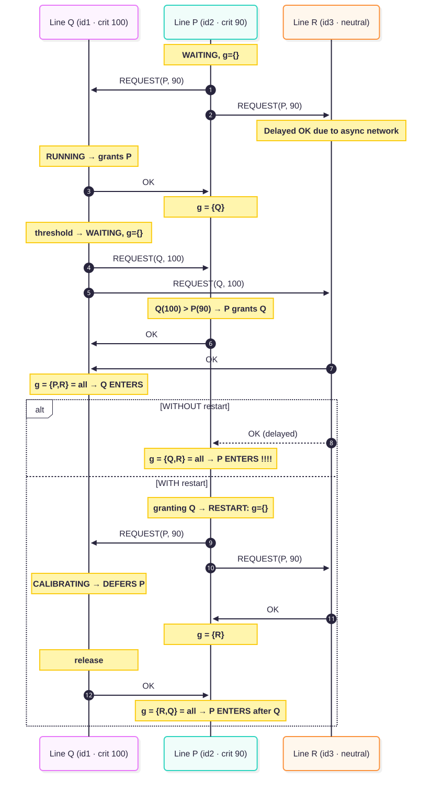
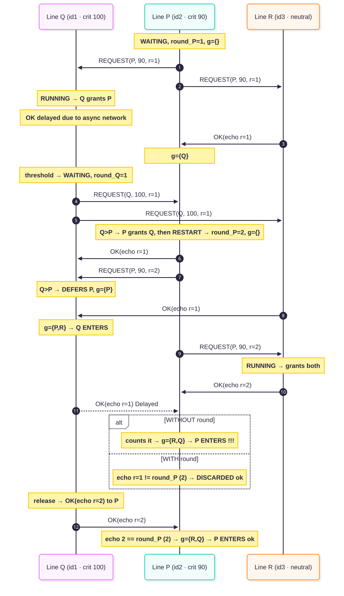

# SMARTFAB

The system consists of a peer-to-peer network of **production lines** with an
**administration server** used for line-bootstrap and telemetry. Coordination
for access to calibration mode is decentralized and happens exclusively through
gRPC between peers.

### Production line

This is the edge node, organized as a concurrent pipeline of *threads* that
communicate through shared *buffers* following a producer–consumer scheme:

- **MonitoringSensor** — thread that simulates the sensor and deposits vibration
  measurements into the `MeasurementBuffer`.
- **SlidingWindowProcessor** — thread that consumes the measurements, computes
  the average over a sliding window and writes the result into the
  `AveragesBuffer`. When the average exceeds the critical threshold, emits
  `CriticalStatusEvent`.
- **AveragesConsumer** — thread that pulls the aggregated averages
  them over **MQTT** (telemetry).
- **MeasurementBuffer / AveragesBuffer** — thread-safe buffers.
- **gRPC server** (`CalibrationServiceImpl`) — exposes `requestCalibration`,
  `grantCalibrationAccess` and `joinP2P`: it is the entry point for the mutual
  exclusion messages and for new peers joining the network.
- **Mutual exclusion peer** (`RicartMutualExclusionPeer`) — encapsulates the
  algorithm logic and the line's state machine (*Running*,
  *WaitingForCalibration*, *UnderCalibration*).

Everything is wired together by a small **event bus** (`EventDispatcher` /
`EventListener`): the `ProductionLine` observes the domain events
(`CriticalStatusEvent`, `CalibrationGrantEvent`, `CalibrationTerminatedEvent`)
and reacts by suspending the sensor, requesting calibration or releasing calibration.

### Administration REST client

`PeerRestClient` is used at startup: the line registers with the a
server and receives in return the list of already-active peers, with which it
opens the gRPC channels. Once the bootstrap is complete, the line does not
depends on the server to coordinate.

### Spring administration server

REST server (Spring) responsible for peer **registration and discovery** and for
**telemetry collection**. It does not take part in mutual exclusion
coordination, only a network registry and a data collector.

### MQTT

Outbound telemetry channel: each line publishes its aggregated averages to an
MQTT broker, keeping data dissemination separate from the coordination process
(which stays entirely on point-to-point gRPC).

## Algorithm: Ricart–Agrawala with criticality-based priority

Mutual exclusion over access to calibration adopts the **Ricart–Agrawala**
algorithm, but replaces Lamport's logical clock with an application-defined
priority rule. The total order among concurrent requests is the pair
`(criticality, id)`: the higher criticality wins and, on a tie, the
identifier. Criticality is computed as `(v̄ − θ) / θ`, fixed upon entering the
waiting state and kept constant until calibration ends.

The base protocol remains the classic one: the line broadcasts its ip,port and id to
all peers, collects the grants and enters the critical section only after every
peer has agreed. On exit it sends out the deferred grants.

### The problem

Standard Ricart–Agrawala orders requests with a Lamport timestamp, which is
*causal*: if a line has seen your request, any request it issues afterwards
carries a larger timestamp, so it is automatically placed *after* you.

Criticality does not have this property. A line can grant permission while it is
still in *Running* — it isn't competing yet, so it says "OK" to everyone — and
only later cross the threshold and ask for calibration with a *higher*
criticality. At that point it has already handed out a permission that no longer
reflects reality: it competes and wins, while the line it granted still holds
that stale "OK". Both can then reach a full set of permissions and enter
calibration together, breaking mutual exclusion.

### The fix — restart

When a waiting line receives a request from a *more critical* one, it yields:
it grants the permission, then **restarts** its own attempt — it throws away the
permissions collected so far and broadcasts its request again. Because the stale
grant is discarded, the line can no longer enter with it; it will regain access
only after the more critical line releases the resource. This keeps a single
line in calibration even when several cross the threshold at nearly the same
time.

### The fix — round

The restart alone is not enough on an asynchronous network, where a message can
be delivered late. A permission granted "blindly" may arrive *after* the request
that should have invalidated it — and it would be counted as valid again. To
prevent this, every request carries a local **attempt number (round)**, which
each grant echoes back. A line accepts a grant only if its round matches the
current attempt; a grant carrying an old round is simply dropped. 

## Usage

The `Makefile` wraps build and run of every component. The `run-*` targets each
depend on `build` and on `run-mqtt-broker`, so they recompile the sources and
bring up the MQTT broker automatically before starting.

Prerequisites: a JDK and Docker (the broker runs via `docker compose`); the
Gradle wrapper is bundled, no local Gradle needed.

| Command | Purpose |
| --- | --- |
| `make build` | Compile the sources (`./gradlew compileJava`). |
| `make clean` | Remove build artifacts. |
| `make run-mqtt-broker` | Start the MQTT broker (`docker compose up -d`). |
| `make run-admin-server` | Start the Spring administration server (registration, discovery, telemetry). |
| `make run-admin-client` | Start the administration CLI. |
| `make run-pl-instance ARGS="<id> <ip> <port>"` | Start a production line with the given identifier and gRPC endpoint. |

                                                                                           

