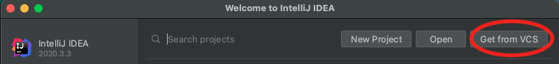

# Project Setup

You can import the project directly from a *Version Control System*, by providing the following URL:
https://gitlab.di.unimi.it/ewlab/public/teaching/distributed-and-pervasive-systems/project-setup.git

- Otherwise, take care to import the project as a Gradle Project
- If required, trust the project and accept the Gradle auto-import
- Then, wait until the Gradle indexing process ends (it may take a few seconds)

